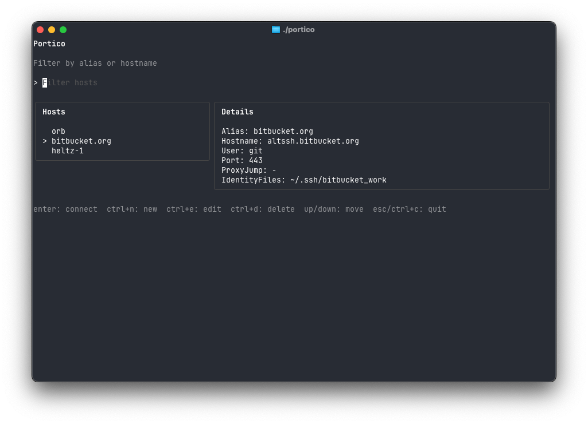

# Portico

Portico is a community-driven SSH workspace for the terminal.

It aims for the same calm, useful feel as modern terminal tools: fast, readable, and focused on trust.

## Overview



## Status

Portico is early, but usable. It already supports browsing and safely editing `~/.ssh/config` from a Bubble Tea interface.

## What it does today

- Reads your SSH config
- Shows a searchable host list
- Displays host details for the selected entry
- Creates new host entries
- Edits existing host entries
- Deletes host entries with confirmation
- Shows a save preview before writing changes
- Creates timestamped backups before save
- Uses atomic writes and safety checks for config updates

## Shortcuts

- `Up` / `Down`: move selection
- `Enter`: connect to selected host
- `Ctrl+N`: create host
- `Ctrl+E`: edit selected host
- `Ctrl+D`: delete selected host
- `Ctrl+S`: preview save while editing
- `Esc`: back or quit

## Local development

```sh
go test ./...
go run ./cmd/portico
```

## Requirements

- Go 1.24+
- macOS or Linux

## Contributing

Contributions are welcome.

- Branch from `master` for active development.
- Use short-lived feature branches.
- Keep changes small and reviewable
- Prefer safe defaults and clear UX
- Add tests for behavior changes
- Avoid adding secrets or hidden persistence

## Roadmap

- Local SSH key management
- Guided onboarding and key verification
- Release packaging and installer

## License

This project will be released under an open-source license.
